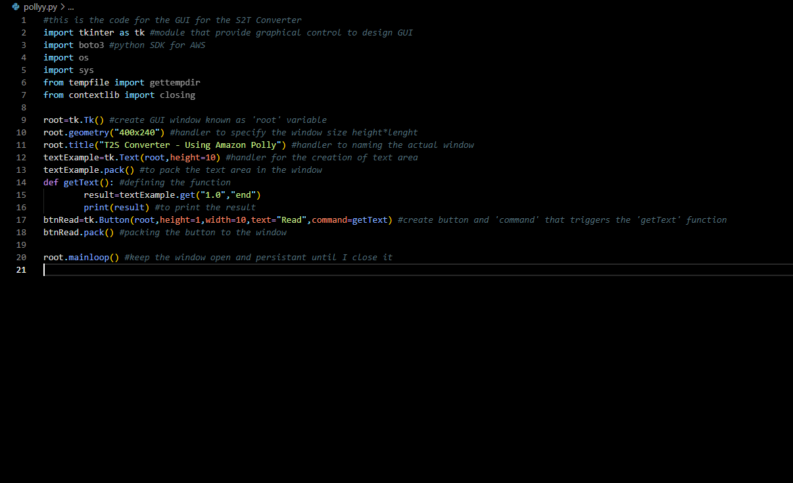
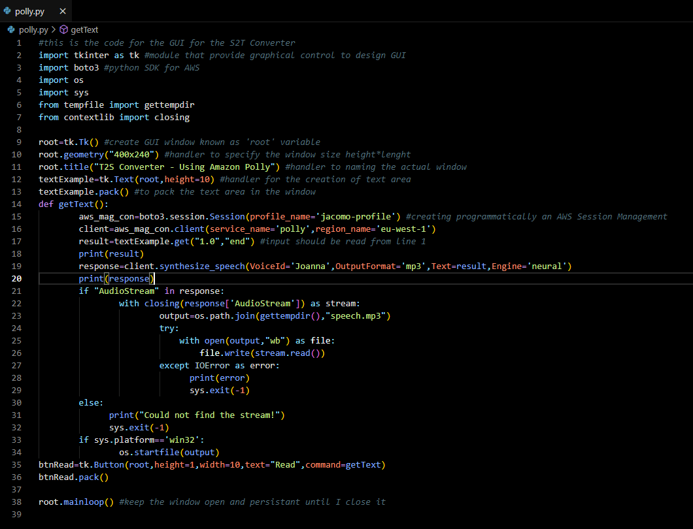

# AWS Text To Speech

<h2>Text to Speech using AWS Polly and Boto3</h2>

In this small project I would like to show a simple text to speech converter using the AWS Polly service and the boto3 python SDK for AWS.
 Before show you the development behind this small application I would like to take a moment to explain what is Amazon Polly and why we are using the boto3 python SDK. 
 Amazon Polly is a service that turns text into lifelike speech, allowing you to create application that talk and design products that are speech-interactive and increase engagement and accessibility.
 Polly's text-to-speech (TTS) uses advance deep learning technologies to synthesize natural sounding human speech.
 Amazon Polly supports multiple languages and includes a variety of lifelike voices, so developers can build speech-enabled applications that work in multiple locations and use the ideal voice for their customers.
 In addition to Standard TTS voices, Amazon Polly offers Neural Text-to-Speech(NTTS) voices that deliver advanced improvements in speech quality. 
 In this project we wont use the AWS Console, instead we will create our own GUI using Python tkinter and we will access the Polly service thanks to python boto3 SDK. 
 I wont go through the full code explanation, instead I will provide the code screen with all the comments in place. 
 In the picture below it is shown the GUI design using Tkinter
 

<h3>AWS Boto3 SDK</h3>

Before dive
 
In this project we will be using the 'synthesize_speech()' method. 
 
response = client.synthesize_speech( 
    Engine='standard'|'neural',
    LanguageCode='arb'|'cmn-CN'|'cy-GB'|'da-DK'|'de-DE'...,
    LexiconNames=[
        'string',
    ],
    OutputFormat='json'|'mp3'|'ogg_vorbis'|'pcm',
    SampleRate='string',
    SpeechMarkTypes=[
        'sentence'|'ssml'|'viseme'|'word',
    ],
    Text='string',
    TextType='ssml'|'text',
    VoiceId='Aditi'|'Amy'|'Astrid'|'Bianca'...
)
 This is the syntax where we actually request Amazon Polly to synthesize our speech and there are the information that we need provide.

